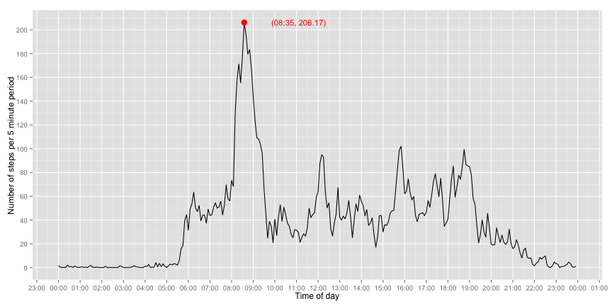
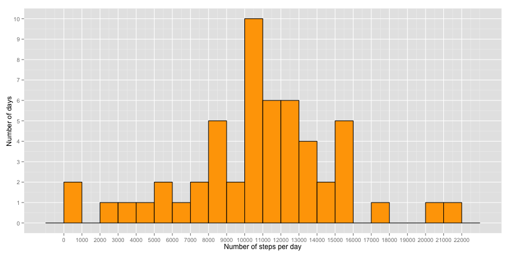
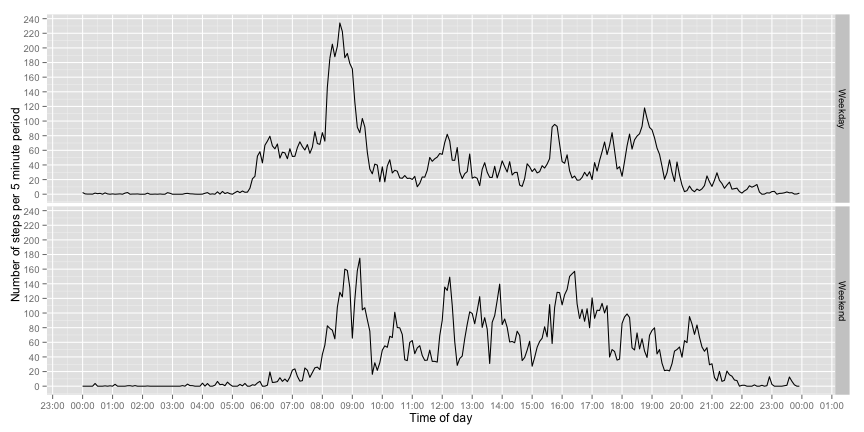

# Reproducible Research: Peer Assessment 1

## Loading and preprocessing the data

If the zip-file "repdata_data_activity.zip" does not exist, download and unzip it. 


```r
# Some libraries we'll use later
library(ggplot2)
library(scales)
library(plyr)

# Download the URL into the filename if the file does not exist.
data_url <- "https://d396qusza40orc.cloudfront.net/repdata%2Fdata%2Factivity.zip"
filename <- "repdata_data_activity.zip"

if (!file.exists(filename)){
  cat("File did not exist, downloading...\n")
  download.file(data_url, filename, method="curl")
  unzip(filename)
}

# Read file
dataset <- read.csv("activity.csv")
```

Five minute intervals are encoded as hour and minute, so to plot this nicely we need to change this and create a column with a nicer format.
Make sure all elements have four characters. Prepend with '0's if necessary. For example 00:15 is just printed as `15`. 

Do this three times, for strings of length 1, 2 and 3. There are no 0-length strings, and strings of length 4 are already in the correct format.

Then use `as.POSIXct` to create a new column. This column will contain the date as well, but it's the same date. Remove the temporary column. 


```r
 dataset$date <- as.Date(dataset$date)

# Convert interval to character
dataset$interval_char <- as.character(dataset$interval)


dataset[nchar(dataset$interval_char) == 1,
	"interval_char"] <- paste("000", dataset[nchar(dataset$interval_char) == 1,
	"interval_char"], sep="")

dataset[nchar(dataset$interval_char) == 2,
	"interval_char"] <- paste("00", dataset[nchar(dataset$interval_char) == 2,
	"interval_char"], sep="")

dataset[nchar(dataset$interval_char) == 3,
	"interval_char"] <- paste("0", dataset[nchar(dataset$interval_char) == 3,
	"interval_char"], sep="")

# Make a new column with the correct interval in POSIXct
dataset$interval_corrected <- as.POSIXct(dataset$interval_char, format="%H%M")

# Remove the character only column
dataset$interval_char  <- NULL
```

## What is mean total number of steps taken per day?


```r
dataperday <- aggregate(data=dataset,steps~date, FUN=sum)

ggplot(data=dataperday, aes(x=steps)) + 
	geom_histogram(binwidth=1000, fill="orange", color="black") +
	xlab("Number of steps per day") +
	ylab("Number of days")+
	scale_x_continuous(breaks=seq(0,max(dataperday$steps)+1000,by=1000))+
	scale_y_continuous(breaks=pretty_breaks(n=10))
```

 

```r
meanperday <- mean(dataperday$steps)
medianperday <- median(dataperday$steps)
```

The mean number of steps per day is 1.0766 &times; 10<sup>4</sup> and the median number of steps is 10765.

## What is the average daily activity pattern?


```r
intervalagg <- aggregate(data=dataset,steps~interval_corrected, FUN=mean)

# Finding the interval with the maximum number of steps

maxpoint <- intervalagg[intervalagg$steps == max(intervalagg$steps),]
maxtime <- strftime(maxpoint$interval_corrected, format="%H:%M")
maxsteps <- round(maxpoint$steps, digits=2)

ggplot(data=intervalagg,
	aes(x=interval_corrected, y=steps)) + 
	geom_line() +
	xlab("Time of day") +
	ylab("Number of steps per 5 minute period") +
	scale_x_datetime(labels = date_format("%H:%M"),
		breaks="1 hour") +
	scale_y_continuous(breaks=pretty_breaks(n=10)) +
	geom_point(data=maxpoint,
		aes(x=interval_corrected, y=steps),
		color="red",
		size=4) +
	geom_text(data=maxpoint,
		aes(x=interval_corrected, y=steps), color="red",
		size = 4, 
		label=paste("(", maxtime, ", ", maxsteps, ")", sep=""), 
		hjust = -.5)
```

 

```r
# Which interval contains the maximum number of steps
maxtime
```

```
## [1] "08:35"
```

The time interval with the maximum number of steps is 08:35. The number of steps were 206.17.

## Imputing missing values

Replacing the NAs with the mean per day seems to have less impact on the mean and median than using the mean per interval, so that's what I'll use.
Using [a method](http://stackoverflow.com/questions/9322773/how-to-replace-na-with-mean-by-subset-in-r-impute-with-plyr) found on [Stack overflow](http://www.stackoverflow.com).

There are 2304 missing values.


```r
 sum(is.na(dataset$steps))
```

```
## [1] 2304
```

```r
# Add ID column since plyr is gpoing to reorder stuff by group
dataset$id <- seq_along(dataset$steps)

# replace(x, list, values), i.e replace the NAs in x with the mean
replaceWithMean<- function(x) replace(x, is.na(x), median(x, na.rm = TRUE))

# ddply for splitting data frame, apply function, and return results in a data frame.
# Group by interval, i.e. replace with the mean for that day since this didn't change the day mean
# or median
dataset_filled <- ddply(dataset, ~ date, transform, steps = replaceWithMean(steps))

# Fix order
dataset_filled <- dataset_filled[order(dataset_filled$id), ]

# Remove ID columns

dataset$id <- NULL
dataset_filled$id <- NULL

dataperday <- aggregate(data=dataset_filled,steps~date, FUN=sum)

ggplot(data=dataperday, aes(x=steps)) + 
	geom_histogram(
		binwidth=1000,
		fill="orange",
		color="black") +
	xlab("Number of steps per day") +
	ylab("Number of days") +
	scale_x_continuous(breaks=seq(0,max(dataperday$steps)+1000,by=1000))+
	scale_y_continuous(breaks=pretty_breaks(n=10))
```

 

```r
meanperday <- mean(dataperday$steps)
medianperday <- median(dataperday$steps)
```

The mean number of steps per day is 1.0766 &times; 10<sup>4</sup> and the median number of steps is 1.0765 &times; 10<sup>4</sup>.

## Are there differences in activity patterns between weekdays and weekends?

First create a column containing the text `Weekday` or `Weekend`. Easier to use `POSIXlt` since weekdays gives locale specific output. Saturday is 6, Sunday is 0.

Redo the aggregation, but add the `daytype` so that we do the aggregation on both `interval_corrected`
and `daytype`. 


```r
# Set all days to be weekdays
dataset_filled$daytype <- "Weekday"

# Set weekends to be weekends :)
dataset_filled[
	as.POSIXlt(dataset_filled$date)$wday == 6 | as.POSIXlt(dataset_filled$date)$wday == 0,
	"daytype"] <- "Weekend"

# Need to have factor here.
dataset_filled$daytype <- factor(dataset_filled$daytype)

# Aggregate steps per daytype and interval.
intervalagg <- aggregate(data=dataset_filled,steps~interval_corrected+daytype, FUN=mean)

ggplot(data=intervalagg ) + 
	geom_line(aes(x=interval_corrected, y=steps)) +
	xlab("Time of day") +
	ylab("Number of steps per 5 minute period") +
	scale_y_continuous(breaks=pretty_breaks(n=10)) +
	scale_x_datetime(labels = date_format("%H:%M"), breaks="1 hour") +
	facet_grid(daytype~.)
```

 
