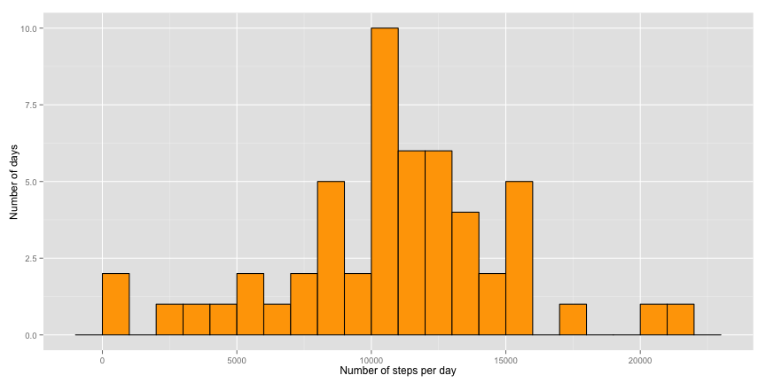
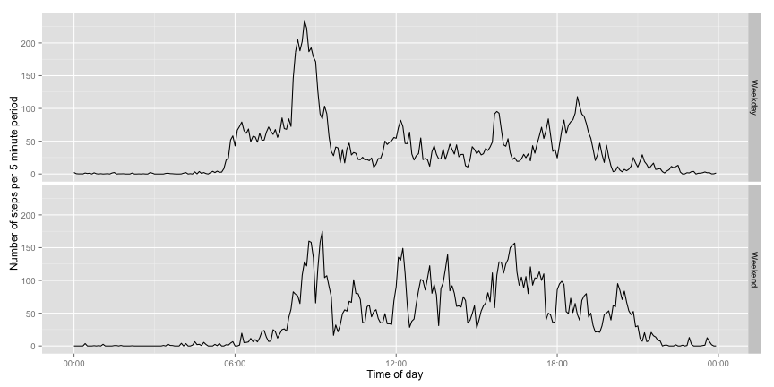

# Reproducible Research: Peer Assessment 1


## Loading and preprocessing the data

If the zip-file "repdata_data_activity.zip" does not exist, download and unzip it.


```r
# Might need to set this if the language is not English
Sys.setlocale("LC_ALL", 'en_US.UTF-8')
```

```
## [1] "en_US.UTF-8/en_US.UTF-8/en_US.UTF-8/C/en_US.UTF-8/sv_SE.UTF-8"
```

```r
library(ggplot2)
library(scales)
library(plyr)

data_url <- "https://d396qusza40orc.cloudfront.net/repdata%2Fdata%2Factivity.zip"
filename <- "repdata_data_activity.zip"

if (!file.exists(filename)){
  cat("File did not exist, downloading...\n")
  download.file(data_url, filename, method="curl")
  unzip(filename)
}

# Read file
dataset <- read.csv("activity.csv")
```
5-min intervals are encoded as hour and minute, so to plot this nicely we need to change this.
Make sure all elements have four characters. Prepend with 0s if necessary. For example 0015 is just printed as 00. Do this three times, for strings of length 1,2 and 3. There are no 0 length strings, and strings of length 4 are already in the correct format.


```r
 dataset$date <- as.Date(dataset$date)

# Convert interval to character
dataset$interval_char <- as.character(dataset$interval)


dataset[nchar(dataset$interval_char) == 1,
	"interval_char"] <- paste("000", dataset[nchar(dataset$interval_char) == 1,
	"interval_char"], sep="")

dataset[nchar(dataset$interval_char) == 2,
	"interval_char"] <- paste("00", dataset[nchar(dataset$interval_char) == 2,
	"interval_char"], sep="")

dataset[nchar(dataset$interval_char) == 3,
	"interval_char"] <- paste("0", dataset[nchar(dataset$interval_char) == 3,
	"interval_char"], sep="")

# Make a new column with the correct interval in POSIXct
dataset$interval_corrected <- as.POSIXct(dataset$interval_char, format="%H%M")

# Remove the character only column
dataset$interval_char  <- NULL
```

## What is mean total number of steps taken per day?


```r
dataperday <- aggregate(data=dataset,steps~date, FUN=sum)

ggplot(data=dataperday, aes(x=steps)) + 
	geom_histogram(binwidth=1000, fill="orange", color="black") +
	xlab("Number of steps per day") +
	ylab("Number of days")
```

 

```r
mean(dataperday$steps)
```

```
## [1] 10766
```

```r
median(dataperday$steps)
```

```
## [1] 10765
```


## What is the average daily activity pattern?


```r
intervalagg <- aggregate(data=dataset,steps~interval_corrected, FUN=mean)

ggplot(data=intervalagg, aes(x=interval_corrected, y=steps)) + 
	geom_line() +
	xlab("Time of day") +
	ylab("Number of steps per 5 minute period") +
	scale_x_datetime(labels = date_format("%H:%M"))
```

 

## Imputing missing values


```r
 sum(is.na(dataset$steps))
```

```
## [1] 2304
```

```r
# Add ID column since plyr is gpoing to reorder stuff by group
dataset$id <- seq_along(dataset$steps)

# replace(x, list, values), i.e replace the NAs in x with the mean
replaceWithMean<- function(x) replace(x, is.na(x), median(x, na.rm = TRUE))

# ddply for splitting data frame, apply function, and return results in a data frame.
# Group by interval, i.e. replace with the mean for that day since this didn't change the day mean
# or median
dataset_filled <- ddply(dataset, ~ date, transform, steps = replaceWithMean(steps))

# Fix order
dataset_filled <- dataset_filled[order(dataset_filled$id), ]

# Remove ID columns

dataset$id <- NULL
dataset_filled$id <- NULL

dataperday <- aggregate(data=dataset_filled,steps~date, FUN=sum)

ggplot(data=dataperday, aes(x=steps)) + 
	geom_histogram(binwidth=1000, fill="orange", color="black") +
	xlab("Number of steps per day") +
	ylab("Number of days")
```

 

```r
mean(dataperday$steps)
```

```
## [1] 10766
```

```r
median(dataperday$steps)
```

```
## [1] 10765
```

## Are there differences in activity patterns between weekdays and weekends?

First create a column containing the text "Weekday" or "Weekend". Easier to use POSIXlt since
weekdays gives locale specific output. 6 is Saturday, 0 is Sunday.

Redo the aggregation, but add the "daytype" so that we do the aggregation on both interval_corrected
and daytype. 


```r
dataset_filled$daytype <- "Weekday"
dataset_filled[
	as.POSIXlt(dataset_filled$date)$wday == 6 | as.POSIXlt(dataset_filled$date)$wday == 0,
	"daytype"] <- "Weekend"

dataset_filled$daytype <- factor(dataset_filled$daytype)
intervalagg <- aggregate(data=dataset_filled,steps~interval_corrected+daytype, FUN=mean)

ggplot(data=intervalagg ) + 
	geom_line(aes(x=interval_corrected, y=steps)) +
	xlab("Time of day") +
	ylab("Number of steps per 5 minute period") +
	scale_x_datetime(labels = date_format("%H:%M")) +
	facet_grid(daytype~.)
```

 
